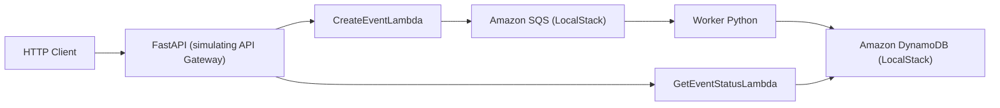

# aws-serverless-demo

Public demo of a serverless architecture for asynchronous event processing using FastAPI, boto3, SQS, DynamoDB, and LocalStack.

## What this project does

This project simulates the `API Gateway -> Lambda -> SQS -> Worker -> DynamoDB` flow.

- The local API receives an event through FastAPI.
- A handler simulates the incoming Lambda.
- The event is sent to an SQS queue.
- A separate worker consumes the queue and processes the message.
- The event status is persisted in DynamoDB.
- The API allows you to query the processing state by `event_id`.

## Architecture diagram



## Technologies used

- Python 3.12
- FastAPI
- boto3
- LocalStack
- Docker Compose
- Pytest

## Structure

```text
.
|-- app/
|-- worker/
|-- tests/
|-- scripts/
|-- docker-compose.yml
|-- Dockerfile
`-- README.md
```

## How to run locally with Docker

1. Start the containers:

```bash
docker compose up --build
```

2. The API will be available at `http://localhost:8000`.

3. LocalStack will be available at `http://localhost:4566`.

If port `8000` is already in use, set `API_PORT=8001` in your environment or `.env` file before starting the stack.

The `scripts/bootstrap_localstack.sh` script automatically creates the `events-queue` queue and the `events-table` table when LocalStack starts.

## How to create an event

```bash
curl -X POST http://localhost:8000/events \
  -H "Content-Type: application/json" \
  -d "{\"event_type\":\"order.created\",\"payload\":{\"order_id\":\"123\",\"amount\":199.9}}"
```

Expected response:

```json
{
  "event_id": "3a4b...",
  "status": "RECEIVED",
  "message": "Event accepted for async processing."
}
```

## How to check the processing status

Use the `event_id` returned when the event was created:

```bash
curl http://localhost:8000/events/<event_id>
```

Example of a final status:

```json
{
  "event_id": "3a4b...",
  "event_type": "order.created",
  "payload": {
    "order_id": "123",
    "amount": 199.9
  },
  "status": "PROCESSED",
  "created_at": "2026-07-02T00:00:00Z",
  "updated_at": "2026-07-02T00:00:05Z",
  "result": {
    "summary": "Event 3a4b... processed successfully",
    "processed_at": "2026-07-02T00:00:05Z",
    "event_type": "order.created",
    "payload_keys": ["amount", "order_id"]
  },
  "error": null
}
```

Possible statuses are `RECEIVED`, `PROCESSING`, `PROCESSED`, and `FAILED`.

## Automated tests

Run the tests with:

```bash
docker compose run --rm api pytest
```

## Challenges and solutions

- Simulating AWS services locally at no cost: LocalStack is used to reproduce SQS and DynamoDB.
- Keeping the project simple and educational: the API calls handlers that represent Lambdas without hiding the asynchronous flow.
- Ensuring event traceability: the status is persisted from the initial request to the end of processing.
- Avoiding tight coupling in tests: the tests use doubles instead of depending on the Docker environment.

## Future improvements

- Add a DLQ for failed messages.
- Create integration tests that start LocalStack during the pipeline.
- Expose worker metrics and tracing.
- Add authentication and stronger schema validation.
- Deploy the solution to real AWS services with API Gateway, Lambda, SQS, and DynamoDB.

## Author

- Gabriel Quintino
- LinkedIn: [add profile](https://www.linkedin.com/in/seu-perfil)
- Email: `your-email@example.com`
